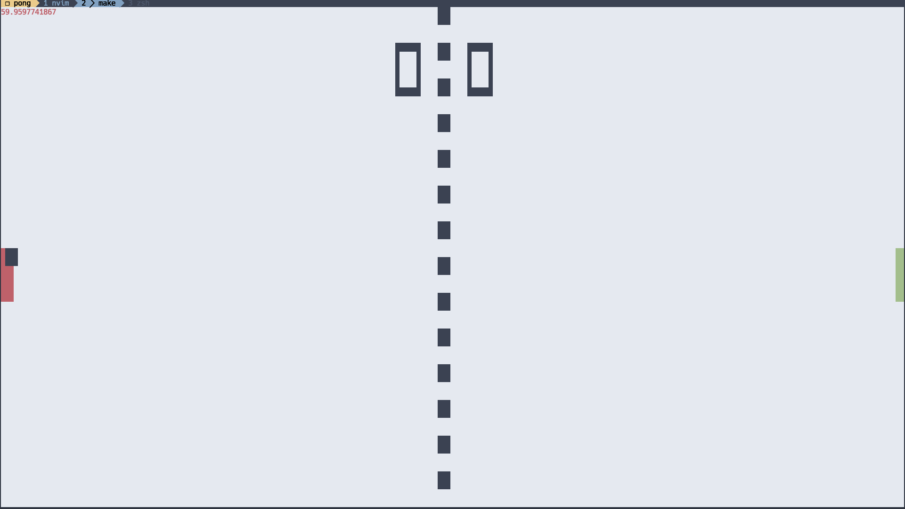

# cloud-pong
Terminal based Cloud Pong

## Running the game

The game requires two servers which are connected together and two clients connect to each of the servers.  To start a basic setup you can use the Makefile provided in the repo.

### Controls

The game can be controlled in two modes, normal mode where each player uses a terminal and separate keyboard and single keyboard mode, where both bats can be controlled from the player 1 terminal. 
By default the game is in Normal mode. To set single keyboard mode you must set the environment variable `SINGLE_KEYBOARD=true` in the player 1 terminal.

### Player 1 - Normal Mode
* Up Arrow - Bat up
* Down Arrow - Bat down
* Space - Serve
* Ctrl+R - Reset game

### Player 2 - Normal Mode
* Up Arrow - Bat up
* Down Arrow - Bat down
* Space - Serve

### Player 1
* W - Bat up
* S - Bat down
* E - Serve
* Ctrl+R - Reset game

### Player 2
* O - Bat up
* L - Bat down
* P - Serve

### Run player 1 API

```
$make start-server-1
(cd api && PLAYER=1 BIND_PORT=6000 UPSTREAM_ADDRESS=localhost:6001 go run main.go)
2019-08-23T19:48:55.993+0100 [INFO]  Dialing connection: server=true
2019-08-23T19:48:55.994+0100 [INFO]  Listening on port: port=6000 player=1
```

### Run player 2 API

```
$ make start-server-2
(cd api && PLAYER=2 BIND_PORT=6001 UPSTREAM_ADDRESS=localhost:6000 go run main.go)
2019-08-23T19:49:33.088+0100 [INFO]  Dialing connection: server=true
2019-08-23T19:49:33.089+0100 [INFO]  Listening on port: port=6001 player=2
2019-08-23T19:49:33.091+0100 [INFO]  Client succesfully connected to the server
```

### Start the player one application which connects to player 1 API

```
$ make player-1
```




### Start the player two application which connects to player 2 API

```
$ make player-2
```


## Environment Variables

## API

* PLAYER (int) - Player number which the API represents, valid values 1 or 2 (default 1)
* BIND_PORT (int) - Port to which the API will listen (default 6000)
* UPSTREAM_ADDRESS (string) - URI corresponding to the opponents API server (default localhost:6001)

## CLI

* PLAYER (int) - Player number which the CLI represents, valid values 1 or 2 (default 1)
* API_URI (string) - URI corresponding to the players API, player 1 must connect to the player 1 API, etc (default localhost:6000)
* SINGLE_KEYBOARD (bool) - Enables the game to run in a single keyboard mode, this can be useful if multiple CLIs are used from the same machine (default false)

## WARNING
This code was a fun weekend hack, the code is largely held together by luck and bandages.
